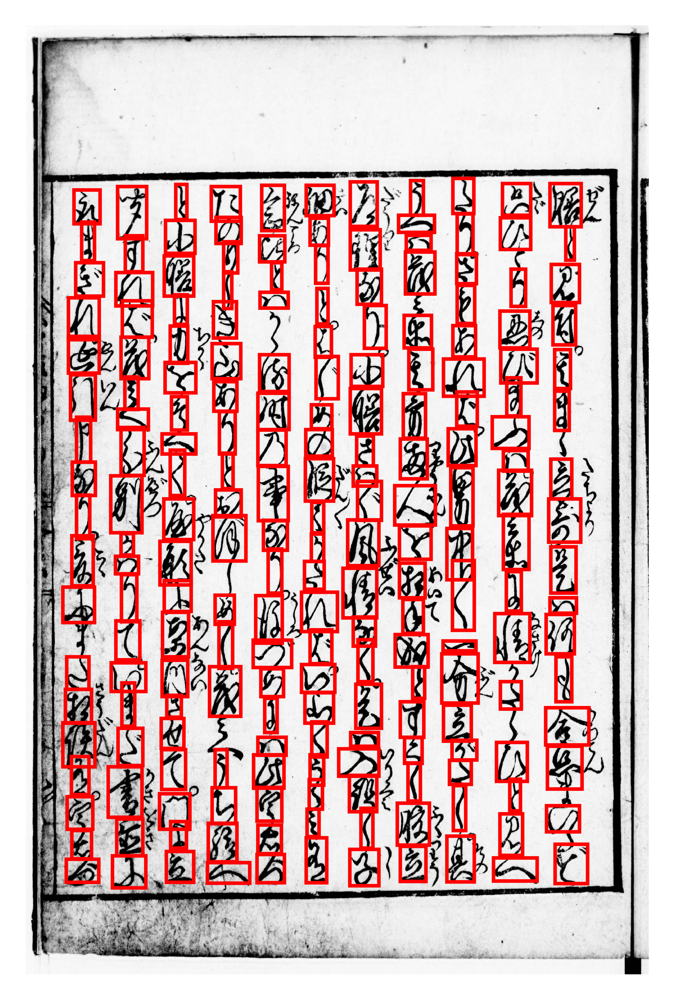

# kuzushiji_recognition

code for kaggle [kuzushiji recognition] (https://www.kaggle.com/c/kuzushiji-recognition)  

A two-stage approach is adopted: Detection + Classification. Out-of-the-box object detection methods, such as Faster-RCNN, SSD, can solve these tow problems together. However, our experiments showed bad results. Therefore, we firstly detect the kuzushiji with Faster-RCNN/RetinaNet detector and classify the proposals later with ResNet50/Xception.    

## Proposal detection

We use google object detection api to train Faster-RCNN/RetinaNet to detection kuzushiji characters in the image. All images are reiszed to 512x512 as a while slide. Splitting original images into large patches (larger and less objects) should improve the accuracy.  

### data preparation for detector training

Google object detection api requires tfrecord files to feed data to the model. To this end, first run ```python process_csv.py``` to convert train.csv to train_obj.csv, which is used to generate tfrecords:  

```python csv2tfrecords.py --csv_input train_obj.csv --label_map_path label_map_obj.pbtxt --img_path train_images ... --output_path ... ```

### train the detector

Config files are provided:  
- Faster-RCNN: faster_rcnn_resnet101.config
- RetinaNet: ssd_resnet101_v1_fpn_shared_box_predictor_oid_512x512.config

Usefully links:
- [Google object detection Api](https://github.com/tensorflow/models/tree/master/research/object_detection)
- [Api Tutorial](https://tensorflow-object-detection-api-tutorial.readthedocs.io/en/latest/)

### export inference graph 

Use ```export_inference_graph.py``` (by Google object detection Api) to export the inference graph, refer to [link](https://tensorflow-object-detection-api-tutorial.readthedocs.io/en/latest/training.html#exporting-a-trained-inference-graph)

### run prediction

Run ```detection.py```, predicted bounding boxes will be saved as detection.csv. Remember to change the test image path and inference graph path to point to the right place of your file orgnization. 

## Classification

We use the basic classification architecture without balancing the different labels and any data augmentation. Since some paper reports better classifaction results of Xception network when classifying large number of labels, we trained a Xception and a ResNet50. No big difference was reported in this kuzushiji recognition probelm, but Xception has significantly less parameters.

The classifier adopts the most basic architecture: backbone network - average pooling - dropout - softmax output layer

### data preparation for classifier traing

```python label_counts.py```   

to genetate label_counts.txt for later use. Change the path to train.csv.

```python ./data/extract_patch.py```  

to extract kuzushiji patches for traing. Patches will be saved as .npy files. Remember to change the path to train.csv and train_images.

### train the classifier

```python train_classification.py```

### classify kuzushiji

```python classify.py```  

it reads the detection results from detection.csv, extract the content in the bounding box and classify the kuzushiji label. Labels and the coordinated of the bounding box center will be saved in submission.csv.

## Results

The pipeline achieves ~0.76 evaluation score without cats and dogs.

## Detection resluts



## Detection + Classification results


